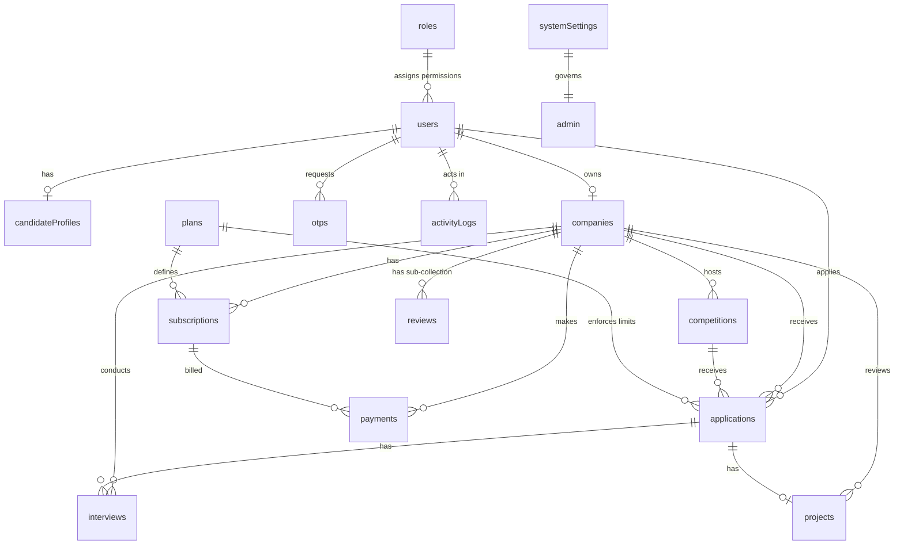

# ProveIt.io - Active Backend Data Dictionary & ER Diagram

This document provides a technical overview of the **active** data structure currently used in the ProveIt.io backend. It reflects the 18 Firestore collections identified from the project's source code.

---

## 1. Entity-Relationship (ER) Diagram

The following diagram illustrates the relationships between the active collections in the system.

---

## 2. Data Dictionary (Active Collections)

### 2.1. Core Authentication & Identity

#### Collection: `users`
Principal identity collection for all platform users.
- **Fields**: [id](file:///d:/Sem%20-6/ANGULAR/ProveIt.io/proveit_frontend_ang/src/app/features/components/sidebar/sidebar.ts#63-98), `fullName`, `email`, `role` (Admin/Company/Candidate), `status`, `profileImage`, `phone`, `isProfileCompleted`, `createdAt`.

#### Collection: `otps`
Temporary security codes for authentication and sensitive actions.
- **Fields**: [id](file:///d:/Sem%20-6/ANGULAR/ProveIt.io/proveit_frontend_ang/src/app/features/components/sidebar/sidebar.ts#63-98) (email), `otp` (hashed), `purpose`, `expiresAt`, `createdAt`.

#### Collection: `roles`
Permission sets for different user levels.
- **Fields**: `name`, `description`, `permissions` (Array), `isSystem`, `createdAt`.

---

### 2.2. User & Company Profiles

#### Collection: `candidateProfiles`
Extended talent data for candidate users.
- **Fields**: `userId` (FK), `skills` (JSON), `experienceLevel`, `education` (JSON), `github`, `resumeUrl`.

#### Collection: `companies`
Business profiles for hiring organizations.
- **Fields**: `ownerId` (FK), `name`, `industry`, `size`, `website`, [logo](file:///d:/Sem%20-6/ANGULAR/ProveIt.io/proveit_frontend_ang/src/app/features/components/dashboard-layout/dashboard-layout.ts#240-243), `plan`, `averageRating`, `reviewCount`, `createdAt`.
- **Sub-Collection: `reviews`**: `authorId`, `authorName`, `rating`, `comment`, `createdAt`.

---

### 2.3. Competition & Hiring Engine

#### Collection: `competitions`
Skill-based hiring challenges.
- **Fields**: `companyId` (FK), [title](file:///d:/Sem%20-6/ANGULAR/ProveIt.io/proveit_frontend_ang/src/app/features/components/dashboard-layout/dashboard-layout.ts#120-123), `description`, `status`, `projectInfo` (JSON), `deadline`, `postedAt`.

#### Collection: `applications`
Candidate entries into specific competitions.
- **Fields**: `userId` (FK), `competitionId` (FK), `companyId` (FK), `status` (APPLIED/SHORTLISTED/etc), `submittedAt`.

#### Collection: `projects`
Code or file submissions for an application.
- **Fields**: `applicationId` (FK), `companyId` (FK), `submissionUrl`, `evaluation` (JSON), `status`, `createdAt`.

#### Collection: `interviews`
Evaluation sessions for candidates.
- **Fields**: `applicationId` (FK), `companyId` (FK), `roundNumber`, `type`, `scheduledAt`, `status`, `feedback`.

---

### 2.4. Billing & Administration

#### Collection: `plans`
Subscription definitions and quotas.
- **Fields**: `name` (STARTER/GROWTH/ELITE), `price`, `description`, `features` (JSON).

#### Collection: `subscriptions`
Active billing status for companies.
- **Fields**: `companyId` (FK), `plan`, `status`, `validFrom`, `validTo`.

#### Collection: `payments`
Financial transaction history.
- **Fields**: `companyId` (FK), `amount`, `plan`, `status` (SUCCESS/FAILED), `transactionId`, `createdAt`.

#### Collection: `systemSettings`
Global platform state configuration (`doc: global`).
- **Fields**: `maintenanceMode`, `registrationOpen`, `aiAssistantEnabled`, `maxFileUploadMB`, `platformVersion`.

---

### 2.5. Support & Monitoring

#### Collection: `supportTickets`
User inquiries and issue logs.
- **Fields**: `name`, `email`, `subject`, [message](file:///d:/Sem%20-6/ANGULAR/ProveIt.io/proveit_frontend_ang/src/app/services/api.service.ts#61-73), `status`, `priority`, `createdAt`.

#### Collection: `activityLogs`
Immutable system audit trail.
- **Fields**: `action`, `severity`, `description`, `actorId`, `createdAt`.

#### Collection: `faqs` & `testimonials`
Content management for the marketing pages.
