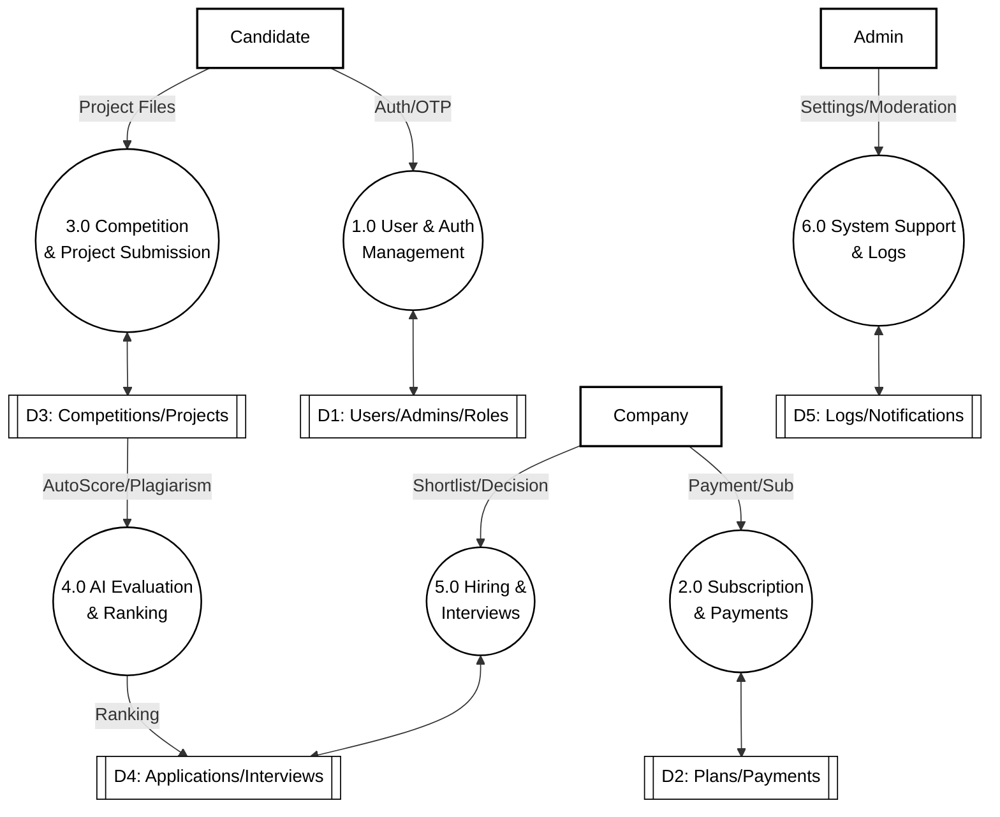

```mermaid
graph TD
    classDef actor fill:#fff,stroke:#000,stroke-width:2px,color:#000;
    classDef process fill:#fff,stroke:#000,stroke-width:1.5px,color:#000;
    classDef datastore fill:#fff,stroke:#000,stroke-width:1px,color:#000;

    Candidate:::actor
    Company:::actor
    Admin:::actor

    P1((1.0 User & Auth<br/>Management)):::process
    P2((2.0 Subscription<br/>& Payments)):::process
    P3((3.0 Competition<br/>& Project Submission)):::process
    P4((4.0 AI Evaluation<br/>& Ranking)):::process
    P5((5.0 Hiring &<br/>Interviews)):::process
    P6((6.0 System Support<br/>& Logs)):::process

    %% Data Stores based on your Schema
    D1[[D1: Users/Admins/Roles]]:::datastore
    D2[[D2: Plans/Payments]]:::datastore
    D3[[D3: Competitions/Projects]]:::datastore
    D4[[D4: Applications/Interviews]]:::datastore
    D5[[D5: Logs/Notifications]]:::datastore

    Candidate -- "Auth/OTP" --> P1
    P1 <--> D1
    
    Company -- "Payment/Sub" --> P2
    P2 <--> D2
    
    Candidate -- "Project Files" --> P3
    P3 <--> D3
    
    D3 -- "AutoScore/Plagiarism" --> P4
    P4 -- "Ranking" --> D4
    
    Company -- "Shortlist/Decision" --> P5
    P5 <--> D4
    
    Admin -- "Settings/Moderation" --> P6
    P6 <--> D5
```