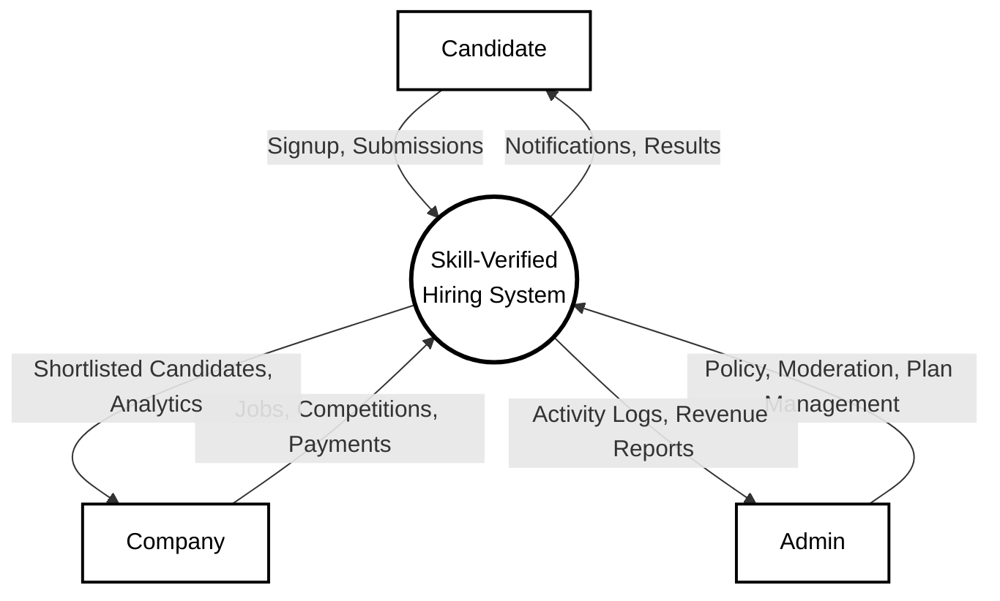

```mermaid
graph TD
    classDef actor fill:#fff,stroke:#000,stroke-width:2px,color:#000;
    classDef system fill:#fff,stroke:#000,stroke-width:3px,color:#000;

    C[Candidate]:::actor
    CO[Company]:::actor
    A[Admin]:::actor
    
    S((Skill-Verified<br/>Hiring System)):::system

    C -- "Signup, Submissions" --> S
    S -- "Notifications, Results" --> C
    
    CO -- "Jobs, Competitions, Payments" --> S
    S -- "Shortlisted Candidates, Analytics" --> CO
    
    A -- "Policy, Moderation, Plan Management" --> S
    S -- "Activity Logs, Revenue Reports" --> A
```