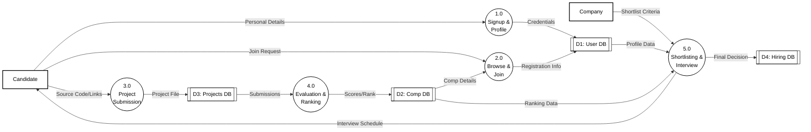

```mermaid
graph LR
    %% Global Styles
    classDef actor fill:#fff,stroke:#000,stroke-width:2px,color:#000;
    classDef process fill:#fff,stroke:#000,stroke-width:1.5px,color:#000;
    classDef datastore fill:#fff,stroke:#000,stroke-width:1px,color:#000;

    %% External Entities
    Candidate[Candidate]:::actor
    Company[Company]:::actor

    %% Processes
    P1((1.0<br/>Signup &<br/>Profile)):::process
    P2((2.0<br/>Browse &<br/>Join)):::process
    P3((3.0<br/>Project<br/>Submission)):::process
    P4((4.0<br/>Evaluation &<br/>Ranking)):::process
    P5((5.0<br/>Shortlisting &<br/>Interview)):::process

    %% Data Stores
    D1[[D1: User DB]]:::datastore
    D2[[D2: Comp DB]]:::datastore
    D3[[D3: Projects DB]]:::datastore
    D4[[D4: Hiring DB]]:::datastore

    %% Data Flows
    Candidate -- Personal Details --> P1
    P1 -- Credentials --> D1
    
    Candidate -- Join Request --> P2
    D2 -- Comp Details --> P2
    P2 -- Registration Info --> D1

    Candidate -- Source Code/Links --> P3
    P3 -- Project File --> D3

    D3 -- Submissions --> P4
    P4 -- Scores/Rank --> D2
    
    Company -- Shortlist Criteria --> P5
    D1 -- Profile Data --> P5
    D2 -- Ranking Data --> P5
    P5 -- Interview Schedule --> Candidate
    P5 -- Final Decision --> D4
```