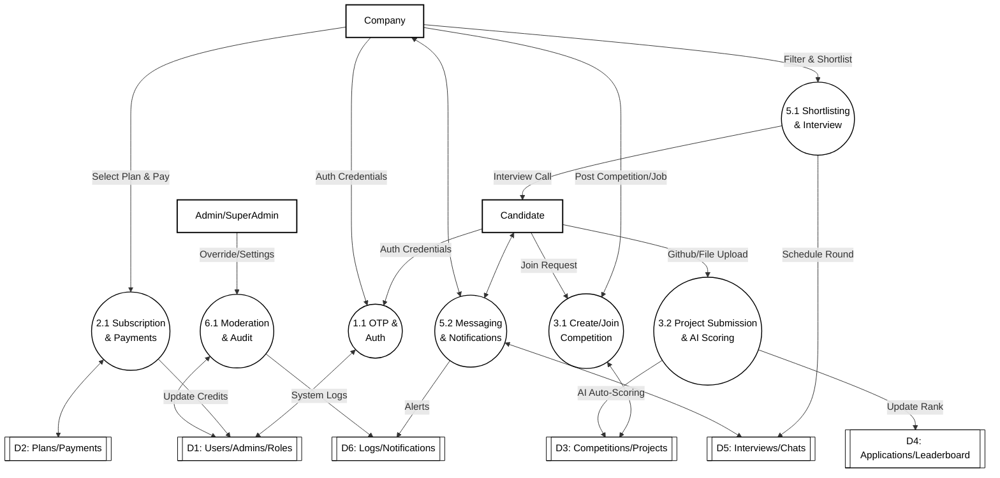

```mermaid

graph TD
    %% Global Styles
    classDef actor fill:#fff,stroke:#000,stroke-width:2px,color:#000;
    classDef process fill:#fff,stroke:#000,stroke-width:1.5px,color:#000;
    classDef datastore fill:#fff,stroke:#000,stroke-width:1px,color:#000;

    %% External Entities
    Candidate[Candidate]:::actor
    Company[Company]:::actor
    Admin[Admin/SuperAdmin]:::actor

    %% --- MODULE 1: AUTH & SUBSCRIPTION ---
    P1_1((1.1 OTP &<br/>Auth)):::process
    P2_1((2.1 Subscription<br/>& Payments)):::process
    
    D1[[D1: Users/Admins/Roles]]:::datastore
    D2[[D2: Plans/Payments]]:::datastore

    Candidate -- "Auth Credentials" --> P1_1
    Company -- "Auth Credentials" --> P1_1
    P1_1 <--> D1
    
    Company -- "Select Plan & Pay" --> P2_1
    P2_1 <--> D2
    P2_1 -- "Update Credits" --> D1

    %% --- MODULE 2: COMPETITION & AI EVALUATION ---
    P3_1((3.1 Create/Join<br/>Competition)):::process
    P3_2((3.2 Project Submission<br/>& AI Scoring)):::process
    
    D3[[D3: Competitions/Projects]]:::datastore
    D4[[D4: Applications/Leaderboard]]:::datastore

    Company -- "Post Competition/Job" --> P3_1
    Candidate -- "Join Request" --> P3_1
    P3_1 <--> D3
    
    Candidate -- "Github/File Upload" --> P3_2
    P3_2 -- "AI Auto-Scoring" --> D3
    P3_2 -- "Update Rank" --> D4

    %% --- MODULE 3: HIRING & COMMUNICATION ---
    P5_1((5.1 Shortlisting<br/>& Interview)):::process
    P5_2((5.2 Messaging<br/>& Notifications)):::process
    
    D5[[D5: Interviews/Chats]]:::datastore
    D6[[D6: Logs/Notifications]]:::datastore

    Company -- "Filter & Shortlist" --> P5_1
    P5_1 -- "Schedule Round" --> D5
    P5_1 -- "Interview Call" --> Candidate
    
    Candidate <--> P5_2
    Company <--> P5_2
    P5_2 <--> D5
    P5_2 -- "Alerts" --> D6

    %% --- MODULE 4: ADMIN CONTROL ---
    P6_1((6.1 Moderation<br/>& Audit)):::process
    
    Admin -- "Override/Settings" --> P6_1
    P6_1 -- "System Logs" --> D6
    P6_1 <--> D1
    
```