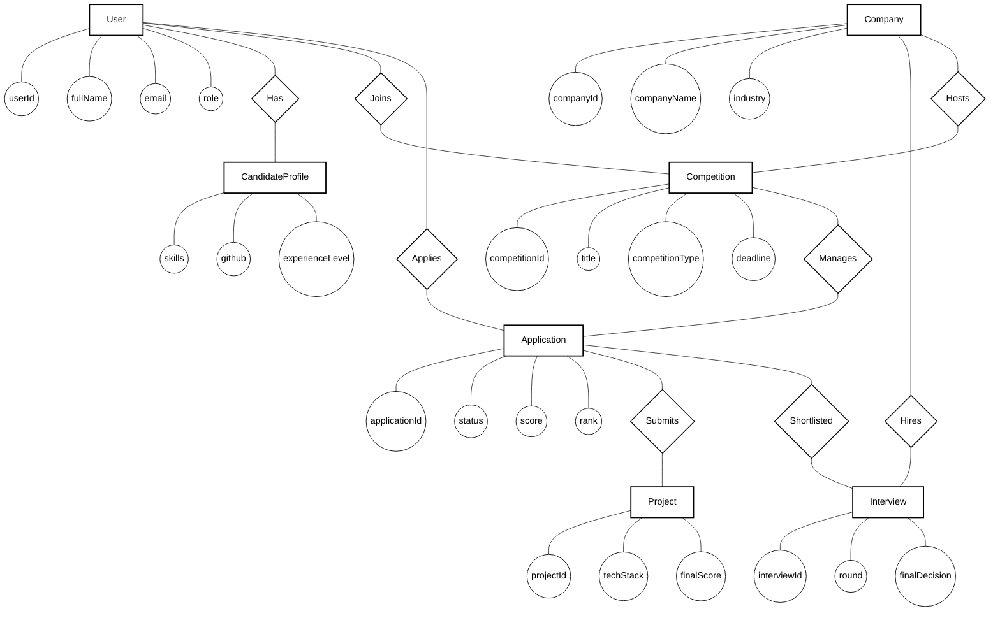

```mermaid
graph TD
    %% Global Styles for Chen's Notation
    classDef entity fill:#fff,stroke:#000,stroke-width:2px,color:#000;
    classDef attribute fill:#fff,stroke:#000,stroke-width:1px,color:#000;
    classDef relation fill:#fff,stroke:#000,stroke-width:1.5px,color:#000;

    %% --- USER & PROFILE (Signup) ---
    User[User]:::entity
    u1((userId)):::attribute
    u2((fullName)):::attribute
    u3((email)):::attribute
    u4((role)):::attribute
    User --- u1
    User --- u2
    User --- u3
    User --- u4

    CP[CandidateProfile]:::entity
    cp1((skills)):::attribute
    cp2((github)):::attribute
    cp3((experienceLevel)):::attribute
    CP --- cp1
    CP --- cp2
    CP --- cp3
    User --- r1{Has}:::relation
    r1 --- CP

    %% --- COMPETITION (Browse/Join) ---
    Comp[Competition]:::entity
    ct1((competitionId)):::attribute
    ct2((title)):::attribute
    ct3((competitionType)):::attribute
    ct4((deadline)):::attribute
    Comp --- ct1
    Comp --- ct2
    Comp --- ct3
    Comp --- ct4

    User --- r2{Joins}:::relation
    r2 --- Comp

    %% --- APPLICATION (Tracking the Flow) ---
    App[Application]:::entity
    a1((applicationId)):::attribute
    a2((status)):::attribute
    a3((score)):::attribute
    %% The rank attribute helps with Leaderboard Ranking
    a4((rank)):::attribute 
    App --- a1
    App --- a2
    App --- a3
    App --- a4

    User --- r3{Applies}:::relation
    r3 --- App
    Comp --- r4{Manages}:::relation
    r4 --- App

    %% --- PROJECT (Submit & Evaluation) ---
    Proj[Project]:::entity
    p1((projectId)):::attribute
    p2((techStack)):::attribute
    p3((finalScore)):::attribute
    Proj --- p1
    Proj --- p2
    Proj --- p3

    App --- r5{Submits}:::relation
    r5 --- Proj

    %% --- INTERVIEW (Shortlist/Hiring) ---
    Int[Interview]:::entity
    i1((interviewId)):::attribute
    i2((round)):::attribute
    i3((finalDecision)):::attribute
    Int --- i1
    Int --- i2
    Int --- i3

    App --- r6{Shortlisted}:::relation
    r6 --- Int

    %% --- COMPANY (Hiring) ---
    Company[Company]:::entity
    co1((companyId)):::attribute
    co2((companyName)):::attribute
    co3((industry)):::attribute
    Company --- co1
    Company --- co2
    Company --- co3

    Company --- r7{Hires}:::relation
    r7 --- Int
    Company --- r8{Hosts}:::relation
    r8 --- Comp
```